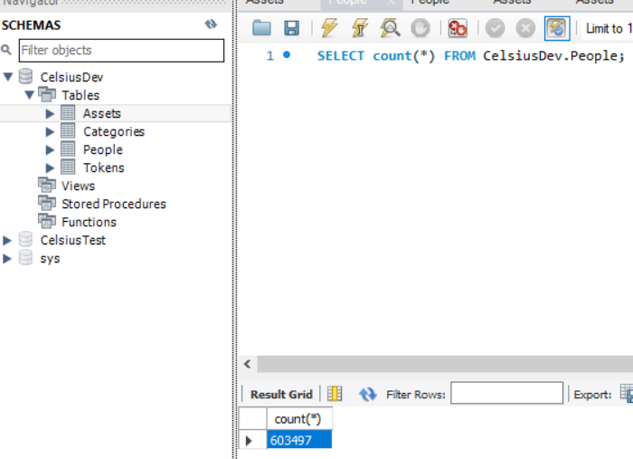

# Purpose

This repo will allow you to parse data from the [Celsius Bankrupcy](https://cases.stretto.com/public/x191/11749/PLEADINGS/1174910062280000000017.pdf) (pg 92) into a database.

I was initially going to perform more analysis on it but [someone already did on reddit](https://www.reddit.com/r/CelsiusNetwork/comments/xz38it/some_stats_and_charts_from_the_celsius_files/).

When complete here is what it can look like (if using MySQL & MSQL Workshop)


# Prep work already completed

The PDFs have alredy been extracted to xlsx foramat (in the data folder).  The data is already in tabular format so this way our code can more easily parse it. 

# Steps to run locally
1. Clone the project
2. Run `npm install`
3. Make sure you have a database you can connect to, currently I'm using mysql
   1. Setup a `.env` file at the project root with the following values
      ```
      DB_USER="root"
      DB_PASSWORD="somePassword"
      DB_NAME="someDBName"
      DB_NAME_TEST="someOtherDBName"
      DB_HOST="127.0.0.1"
      DB_DIALECT="mysql"
      ```
4. Consider if you want to pull in more recent prices
   1. I used [this API call](https://pro-api.coinmarketcap.com/v2/cryptocurrency/quotes/latest?symbol=1INCH,AAVE,ADA,AVAX,BADGER,BAT,BCH,BNB,BNT,BSV,BTC,BTG,BUSD,CEL,COMP,CRV,CVX,DAI,DASH,DOGE,DOT,EOS,ETC,ETH,GUSD,KNC,LINK,LPT,LTC,LUNC,MANA,MATIC,MCDAI,MKR,OMG,ORBS,PAX,PAXG,SGB,SGR,SNX,SOL,SUSHI,TAUD,TCAD,TGBP,THKD,TUSD,UMA,UNI,USDC,USDT,UST,WBTC,WDGLD,XAUT,XLM,XRP,XTZ,YFI,ZEC,ZRX,ZUSD) per [CoinMarketCap docs](https://coinmarketcap.com/api/documentation/v1/#operation/getV2CryptocurrencyQuotesLatest).  If you do so just replace the contents in tokenPrices.ts
4. Run `npm start`
   1. The excel files (PDFs were already converted to excel) will be parsed one by one and inserted into the DB
   2. For reference it took about 5 minutes to complete on my machine using a local MySQL database.

# Fun Stats from this data

After creating the database out of this script there are 603,497 accounts with celsius.  The data sets let you do fun things like compare the total BTC in custody (3816.3954) vs earn (115,028.0173) or individually the max BTC held in custody (75.1354) vs earn (2,084.0916).


As of 10/8/2022 prices when looking at combined earn and custody assets, (and their combined total accross all customers in the range)
- 21.37% of accounts have < $1 ($30,302.20)
- 34.85% of accounts have < $10 ($296,656.90)
- 49.66% of accounts have < $100 ($3,700,813.33)
- 69.98% of accounts have < $1,000 ($52,736,339.03)
- 88.25% of accounts have < $10,000 ($455,122,226.75)
- 98.29% of accounts have < $100,000 ($2,377,079,476.47)
- 99.94% of accounts have < $1,000,000 ($4,383,016,621.79)
- 339 accounts have > $1,000,00 ($1,057,347,527.90)
# Next Steps

From here on futher tools would be required to do something with the data.

# Disclaimer
There is a lot of refactoring that could be done but given it's a one and done script to read and insert data I'm not going to bother. 
